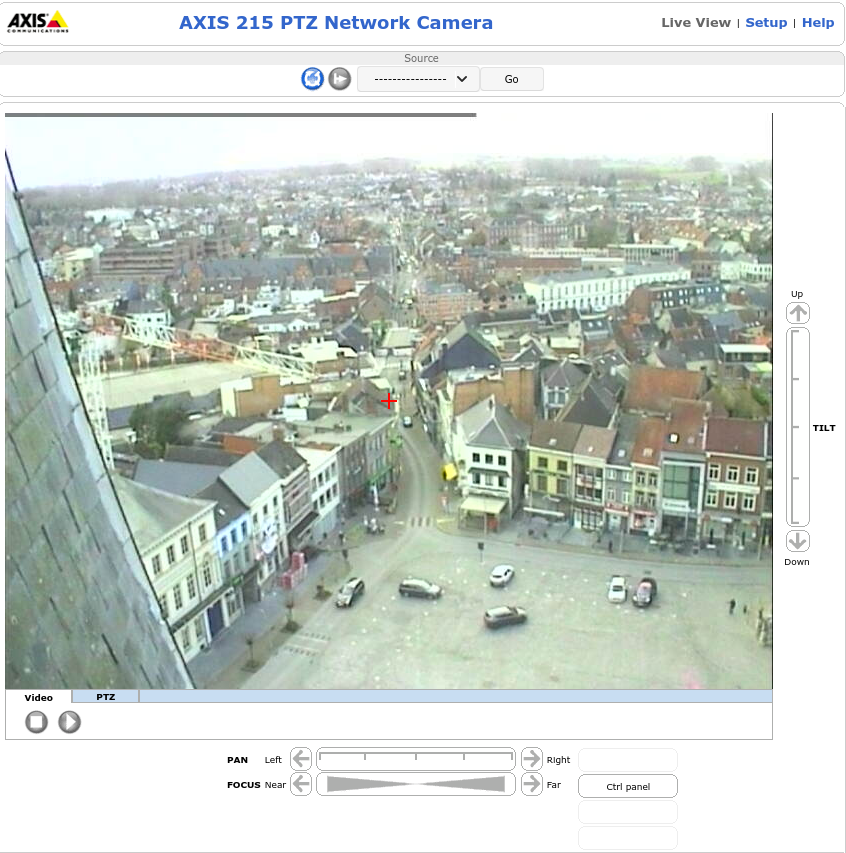
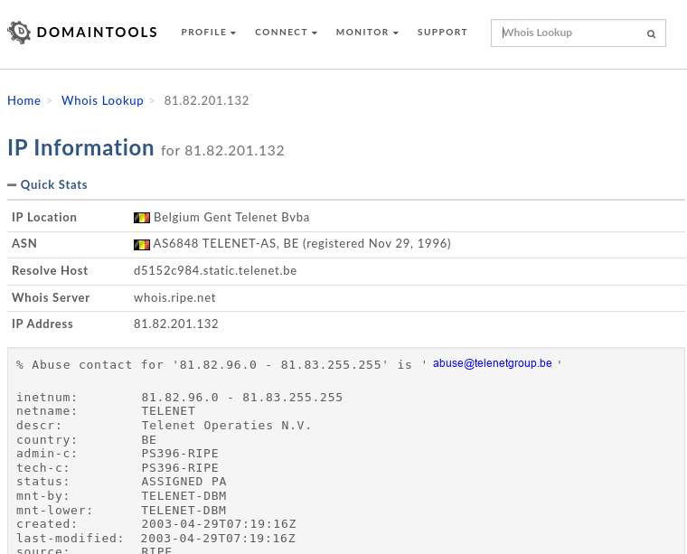

<h1> Challenge: bigbrother </h1>

<h2>Prompt: We've intercepted a live camera feed overlooking a public space. The camera owner has not bothered to put a password on it and its open to the world!

An extremely dangerous criminal on the run was recently spotted by our surveillance team using this camera.

It is essential to our investigation that we find out the COUNTRY where this camera is operating from so we know which law enforcement agency to follow up with.

Please find this out for us.

LIVE CAMERA FEED: http://81.82.201.132</h2>

<h2>Flag:</h2> 
Belguim

<h3>How?</h3>

When the camera feed (http://81.82.201.132) is accessed it opens a pan-tilt-zoom (PTZ) window where you can actually move the camera. The given IP can be put into whoisdomaintools http://whois.domaintools.com/ and it shows the source of the IP is Belgium. Boom! 

