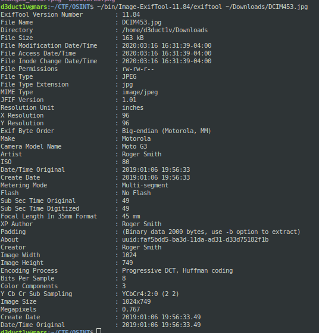

<h1> Challenge: photophile</h1>

<h2>Prompt:</h2> 
We've been investigating an allegedly corrupt infantry soldier. We have strong reason to believe they have been involved in assisting serious organised crime groups with opium production.

I've recovered an image I think was taken by this individual from an unnamed online file storage folder. The name of the file doesn't really give anything away either.

We need to find out what device the attached photo was taken on, as this will be a major breakthrough in linking the individual we have in custody with the drug conspiracy.

If the photo was taken on a device we know to be owned by the accused, then we are a step closer to throwing the book at them.

What is the CAMERA MODEL / DEVICE MODEL of the device used to photograph the poppies?

<h2>Flag:</h2> 
Moto G3

<h3>How?</h3>
Download the file inside the prompt.

Using the ExifTool to pull the metadata under the `Camera Model Name` is the flag.

