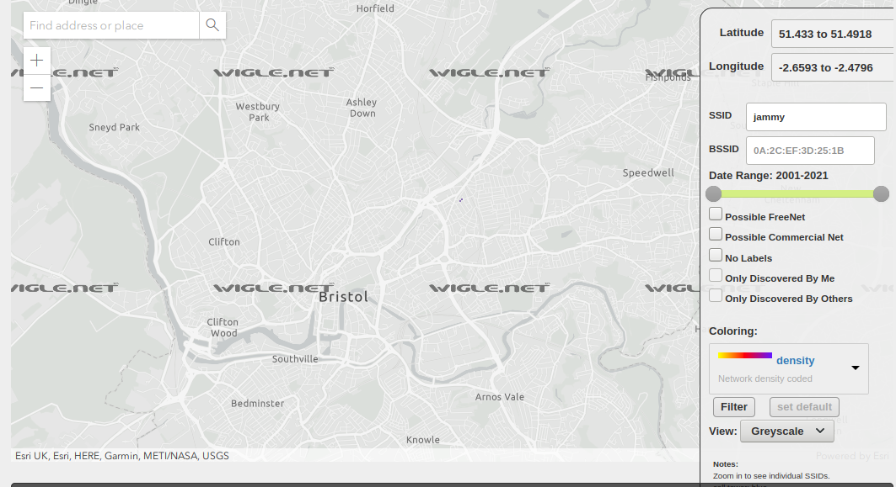
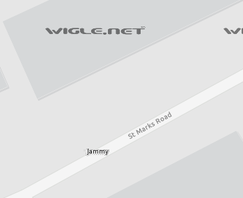

<h1> Challenge: proofinthesignal </h1>

<h2>Prompt:</h2> 
We've received fresh intel from the team leading an important investigation.

We've become aware that one of our targets, James Markson, has retained his links with the city of Bristol, UK.

We've also learned that this individual always has his personal hotspot enabled on his smartphone, as he does not wish to subscribe to a regular home broadband service.

This means the target's WiFi signal from their phone may have registered on a public WiFi mapping service.

One intelligence analyst noted that 'jammy' may be the SSID (the name of the wireless network).

The team says you'll need a sharp eye for this one.

What is the STREET NAME where we the target has likely been in the city of Bristol?

<h2>Flag:</h2> 
St Marks Road

<h3>How?</h3>
Goto: https://wigle.net

Move the map to Bristol in the UK, filter for the SSID `jammy` look for the results on the map.

Zoom in to view the street name. 

