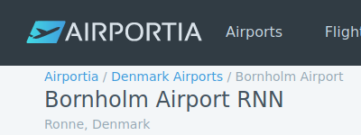

<h1> Challenge: readyfortakeoff</h1>

<h2>Prompt:</h2> 
The special operations team has learned that a target of theirs always takes the first flight out of their local airport every morning.

Please find the TIME OF ARRIVAL AT DESTINATION of that first flight, so that we can place officers to arrest them.

Once again we have very little to go on, aside from what I think is a camera feed.

LIVE CAMERA FEED: http://87.54.59.228

If you're having trouble viewing it, we've also been given a screenshot by them, which is attached.

Please enter the time as HH:MM.

<h2>Flag:</h2> 
06:55

<h3>How?</h3>
Viewing either the live feed from the webcam, or viewing the attached picture we can find the location of the airport. 

Using airportia.com and searching for the city results in 1 airport.

Searching back through the previous days we can see a 06:15 scheduled-departure, this is our earliest available flight.
Clicking on `Track >` we can get the flight details: enter the Scheduled arrival time. 

