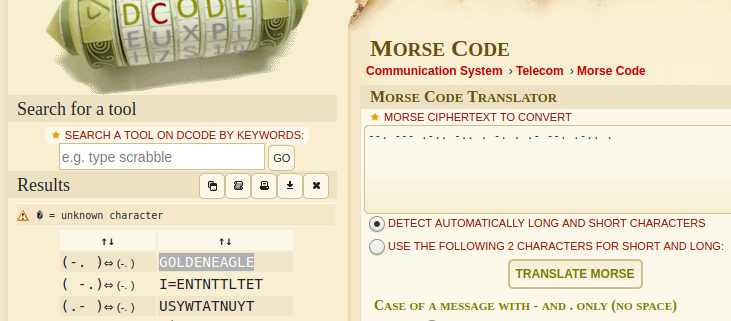

<h1> Challenge: sos</h1>

<h2>Prompt:</h2> 
One of our SIGINT (Signals Intelligence) analysts recently found a strange broadcast sent over the airwaves. We are not certain on the source.

Can you please draw a conclusion on the attached transmission?

<h2>Flag:</h2> 
GOLDENEAGLE

<h3>How?</h3>
Viewing the file: --. --- .-.. -.. . -. . .- --. .-.. .

Morse code!

Goto: https://www.dcode.fr/morse-code

Paste the morse code into the box labeled `Morse ciphertext to convert` click `Translate Morse`

