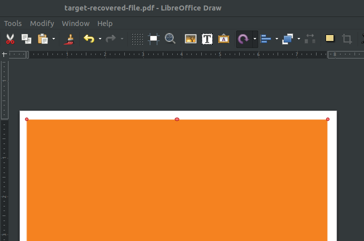

<h1> Challenge: undercover</h1>

<h2>Prompt:</h2> 
The intelligence analysis team has recovered a mysterious file from one of our target's computers following a sting operation in the early hours of this morning.

It seems like there's nothing there, but why would a target have a blank file on their computer? Are they hiding something?

We really need to find the lock combination for the self-storage unit where the target has stashed counterfeit bank notes. We've trawled through all the other files we've found already, and its just this one that remains.

Have a look for us would you?

<h2>Flag:</h2> 
956445

<h3>How?</h3>
Download the file that is in the prompt.  Open the file inside of Powerpoint or LibreOffice Draw.

There is a cell covering the body of the document, cell color changed from white. 

Slide the cover off the document and find the flag hidden under. 

