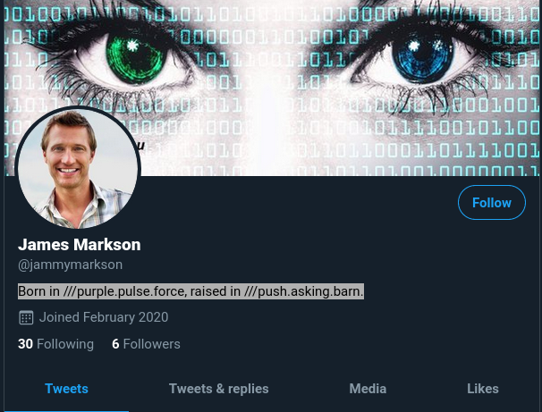

<h1> Challenge: growingup </h1>

<h2>Prompt: Where did James spend his childhood?</h2> 
https://twitter.com/jammymarkson

<h2>Flag:</h2> 
Yorkshire

<h3>How?</h3>
From Twitter profile description: "Born in ///purple.pulse.force, raised in ///push.asking.barn."
First Googled" "pushaskingbarn" and this came up with Wikipedia page listing all towns and ceremonial counties in England.
Then did "cntrl F" for "pu" and this search landed on the town of Pudsey and the ceremonial country equivalnet is actually West Yorkshire, but Yorkshire worked. Call it dumb luck!

