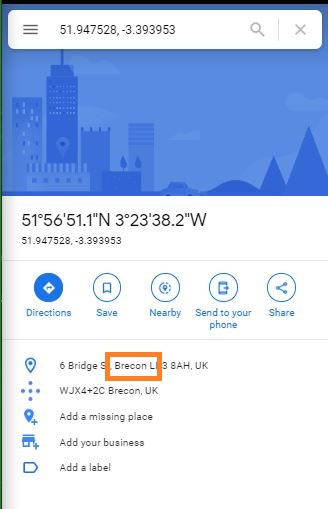

<h1> Challenge: wagthetail</h1>

<h2>Prompt:</h2> 
The team has been trying to work out where Person of Interest, Sarah, walks her dog. This is part of building up a profile of her movements.

Can you have a look to see if you can find the TOWN in which Sarah tends to take the dog out to?

NOTE: If you're having trouble working out who this person is, have a look at other Life Online challenges as they could provide you with an entry point to find these people ;).

<h2>Flag:</h2> 
Brecon

<h3>How?</h3>
From James' Twitter go to Sarah's twitter.

-- From the top grab the x:y coordinates

-- In Google maps search for the coordinates

